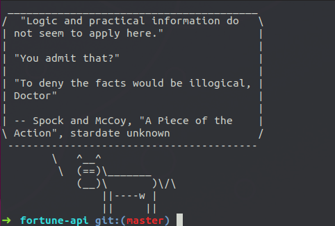
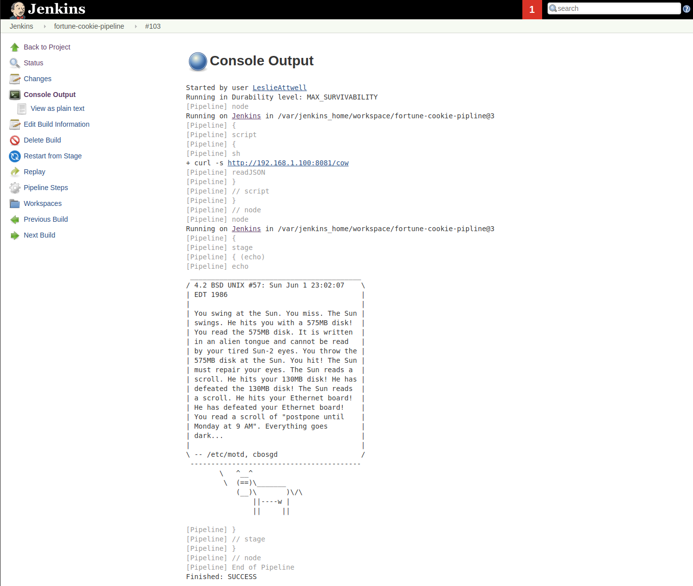

# Fortune Cookie REST API


This is a basic fortune cookie API written in Go giving JSON output. Logic in golang still need to be improved, using switches with a common interface.

`[{"cookie": "message"}]`<br>



## Usage
`http://<your-url>:8081/<option>`

Options:
* fortune - Default fortune cookie output
* cow - fortune cookie piped to cowsay -b
* tux - fortune cookie piped to cowsay -f tux
* tuxtips - fortune fortune ubuntu-server-tips piped to cowsay -f tux

## Build
`docker build -t dockerleslie/fortunecow:1.0 .`

## Run
`docker run -d -p 8081:8081 dockerleslie/fortunecow:1.0 .`


## Sample Jenkins File
```groovy
import groovy.json.JsonSlurper
def getFortuneCookie = {
    fortuneJSON = sh(returnStdout: true, script: 'curl -q http://192.168.1.100:8081/tuxtips')
    myObject = readJSON text: fortuneJSON;
    fortuneCookie =  myObject.cookie[0];
}

node ('master') {
    script {
        getFortuneCookie()
    }
}

pipeline {
    agent any
    stages {
        stage('echo') {
            steps {
                echo "${fortuneCookie}"
            }
        }
    }
}
```

